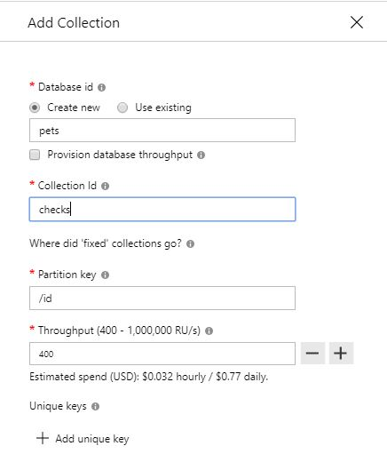

# Running Azure Function

## Running locally

To run Azure Function locally you need the latest version of Visual Studio and Azure Function tools.

Open the solution `SmartHotel360.Website.sln` and open the project `SmartHotel360.WebsiteFunction` edit the `local.settings.json` file with following entries in `Values` section:

* `AzureWebJobsStorage`: Storage Account Connection String
* `AzureWebJobsDashboard`: Storage Account Connection String
* `cosmos_uri`: Cosmos DB (SQL API) URL (eg. https://petpictureuploadmetadata.documents.azure.com:443
* `cosmos_key`: Cosmos DB (SQL API) Key
* `constr`: Cosmos DB (SQL API) Connection String
* `MicrosoftVisionApiKey`: Cognitive Services Vision API Key>
* `MicrosoftVisionApiEndpoint`:Cognitive Services Vision API URL (eg. https://southcentralus.api.cognitive.microsoft.com/vision/v1.0)
* `MicrosoftVisionNumTags`: Tags to fetch from Vision API. For example: 10
* `AzureSignalRConnectionString`: Connection String to the SignalR Service instance

You can deploy these resources automatically with the [Azure Deployment Guide.](AzureDeployment.md#Creating-The-Azure-Resources)

Once the resources are created you need to do some manual steps:

1. Create a blob storage container called `pets` in the storage account and ensure it has public access

2. [Create a database](https://docs.microsoft.com/en-us/azure/cosmos-db/create-sql-api-dotnet#add-a-collection) called `pets` in Cosmos DB. Then add two collection, one called `checks` and other called `leases`.

## Deploy to Azure

To deploy the Azure Function just publish it from Visual Studio following the instructions in the "Publish to Azure" section of the [Azure Function Documentation](https://docs.microsoft.com/en-us/azure/azure-functions/functions-develop-vs).
